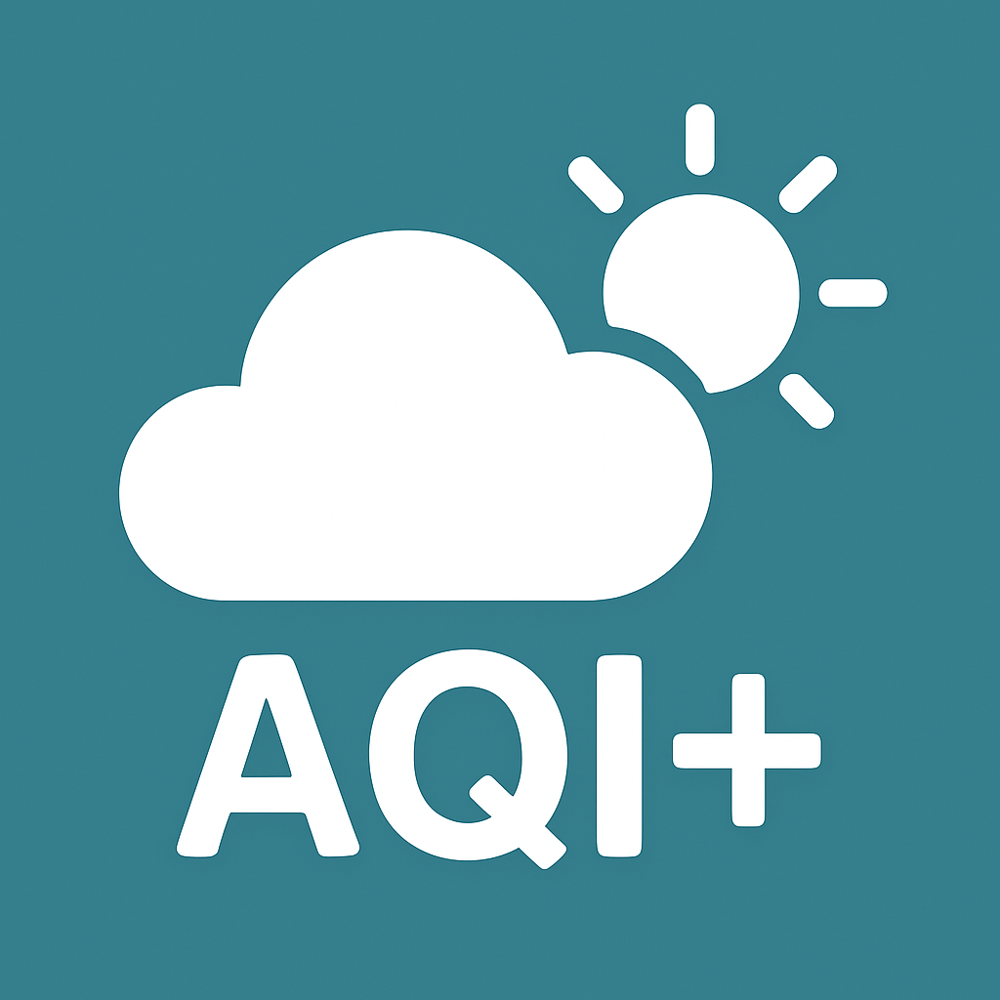

# PM2AQI: PM2.5 to AQI Calculator

<p align="center">
  
</p>

## Overview

PM2AQI is a modern desktop application built with Python and PyQt6. It provides a sleek, user-friendly interface for converting PM2.5 (Particulate Matter) readings to the Air Quality Index (AQI), and displays live weather and AQI data from the Ambient Weather REST API. The app features secure API key management, timezone-correct weather data, and a visually organized, compact UI.

---

## Features

- **Modern PyQt6 Interface**: Clean, professional, and compact UI with summary cards and collapsible details.
- **Live Weather & AQI Data**: Fetches and displays real-time weather and AQI from Ambient Weather devices.
- **Comprehensive Weather Metrics**: View Outdoor/Indoor Temperature, Humidity, Wind, Rain, Barometer (relative/absolute), Dew Point, Feels Like, Solar Radiation, UV Index, and more.
- **Secure API Key Management**: API keys are stored securely in a `.env` file and can be updated from the app.
- **Auto-Refresh**: Optionally auto-refreshes data every 60 seconds.
- **Color-Coded AQI Badge**: Large, color-coded AQI badge with health category and details.
- **Weather Summary**: Key weather stats (Outdoor Temp, Indoor Temp, Wind, Rain).
- **Timezone-Aware**: All weather timestamps are shown in Pacific Time.
- **No .ui Files**: All UI is built in code for easy customization and portability.

---

## Installation

1. **Clone the repository:**

   ```sh
   git clone <your-repo-url>
   cd PM2AQI
   ```

2. **Create a virtual environment (optional but recommended):**

   ```sh
   python -m venv pm2aqi_env
   pm2aqi_env\Scripts\activate  # On Windows
   # Or: source pm2aqi_env/bin/activate  # On macOS/Linux
   ```

3. **Install dependencies:**

   ```sh
   pip install -r requirements.txt
   ```

4. **Add your Ambient Weather API keys:**
   - Launch the app once with `python pm2aqi.py` and enter your API Key and App Key when prompted, or
   - Create a `.env` file in the project root with:
     ```
     AMBIENT_API_KEY=your_api_key_here
     AMBIENT_APP_KEY=your_app_key_here
     ```

5. **Run the app:**

   ```sh
   python pm2aqi.py
   ```

---

## Data Displayed

PM2AQI displays a wide range of real-time weather and air quality data from your Ambient Weather device, including:

- **PM2.5 & AQI**: Outdoor and indoor PM2.5, calculated AQI, health category, and guidance
- **Temperature**: Outdoor and indoor temperature, feels like, and dew point
- **Humidity**: Outdoor and indoor humidity
- **Wind**: Speed, gust, direction, and max daily gust
- **Rainfall**: Hourly, daily, weekly, monthly, and yearly totals
- **Barometer**: Relative and absolute pressure
- **Solar Radiation**: Solar radiation in W/m²
- **UV Index**: Current UV index
- **Other**: Date/time (Pacific Time), and more

All data is presented in a visually organized, easy-to-read format with collapsible details for advanced users.

---

## How it Works

1. **User Input**: Enter a PM2.5 value or fetch live data.
2. **Calculate**: Click 'Calculate AQI' or fetch to see the AQI badge and health info.
3. **Details**: Use 'Show AQI Details' and 'Show More' for full health and weather breakdowns.

---


## License

This project is licensed under the MIT License.
